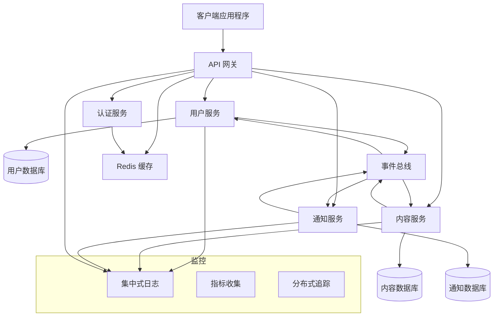

# 复杂系统规范示例

<!-- 导航元数据 -->
<!-- 示例：复杂系统 | 级别：高级示例 | 先决条件：simple-feature-spec.md -->
<!-- 相关：ai-reasoning/decision-frameworks.md, process/design-phase.md, templates/design-template.md -->

**📍 您在这里：** [主指南](../../README.md) → [示例](README.md) → **复杂系统规范**

## 快速导航
- **🎯 从简单开始：** [简单功能规范](simple-feature-spec.md) - 首先从基础示例学习
- **🧠 决策帮助：** [AI 决策框架](../ai-reasoning/decision-frameworks.md) - 处理复杂选择
- **📋 设计流程：** [设计阶段指南](../process/design-phase.md) - 系统化处理复杂性的方法
- **📝 设计模板：** [设计模板](../templates/design-template.md) - 复杂设计的结构

---

本节演示了如何将规范驱动方法应用于更大、更复杂的系统。这些示例展示了如何处理复杂性、将大型功能分解为可管理的组件，以及协调多个相互关联的部分。

## 示例 1：多服务 API 架构

### 概述
一个全面的 API 系统，通过多个微服务处理用户管理、内容交付和实时通知。这个示例演示了如何规范具有多个组件和复杂交互的分布式系统。

### 完整规范文档

#### 需求文档

```markdown
# 多服务 API 架构 - 需求

## 简介
此功能实现了一个可扩展的 API 架构，由多个微服务组成，用于处理用户管理、内容操作和实时通知。系统必须支持高可用性、水平扩展和跨服务的一致数据管理。

## 需求

### 需求 1
**用户故事：** 作为系统架构师，我希望有一个分布式 API 架构，以便系统可以独立扩展并保持高可用性。

#### 验收标准
1. 当系统接收请求时，它应将请求路由到适当的微服务
2. 当某个服务失败时，系统应继续运行，但功能有所降级
3. 当负载增加时，各个服务应能独立扩展
4. 如果服务需要通信，它们应使用定义良好的 API 和消息传递

### 需求 2
**用户故事：** 作为开发人员，我希望在服务之间有一致的数据管理，以便在分布式系统中维护数据完整性。

#### 验收标准
1. 当在一个服务中修改数据时，相关服务应收到更改通知
2. 当事务跨越多个服务时，系统应确保数据一致性
3. 当服务暂时不可用时，数据操作应排队并重试
4. 如果发生数据冲突，系统应有解决策略

### 需求 3
**用户故事：** 作为 API 消费者，我希望能统一访问所有服务，以便通过单一接口与系统交互。

#### 验收标准
1. 当发出 API 请求时，客户端应使用单一入口点
2. 当服务内部发生变化时，外部 API 应保持稳定
3. 当需要认证时，它应在所有服务中一致工作
4. 如果需要限流，它应在整个 API 中统一应用

### 需求 4
**用户故事：** 作为系统管理员，我希望有全面的监控和可观察性，以便我能维护系统健康和性能。

#### 验收标准
1. 当服务运行时，系统应提供健康检查和指标
2. 当发生错误时，它们应跨服务边界被记录和追踪
3. 当性能下降时，应触发带有可操作信息的警报
4. 如果需要调试，应能获得请求流的分布式追踪
```

#### 设计文档

```markdown
# 多服务 API 架构 - 设计

## 概述
系统将使用微服务架构实现，包括用于统一访问的 API 网关、服务之间的事件驱动通信，以及用于认证、日志记录和监控等横切关注点的共享基础设施。

## 架构

### 高级架构


## 组件和接口

### API 网关
- **目的**：单一入口点、路由、认证、限流
- **技术**：Kong/Nginx 与自定义插件
- **职责**：请求路由、SSL 终止、CORS、限流

### 核心服务

#### 用户服务
```typescript
interface UserService {
  // 用户管理
  createUser(userData: CreateUserRequest): Promise<User>;
  getUserById(id: string): Promise<User>;
  updateUser(id: string, updates: UpdateUserRequest): Promise<User>;
  deleteUser(id: string): Promise<void>;
  
  // 认证集成
  validateUserCredentials(email: string, password: string): Promise<AuthResult>;
  updateUserProfile(id: string, profile: ProfileData): Promise<User>;
}
```

#### 内容服务
```typescript
interface ContentService {
  // 内容操作
  createContent(authorId: string, content: CreateContentRequest): Promise<Content>;
  getContent(id: string): Promise<Content>;
  updateContent(id: string, updates: UpdateContentRequest): Promise<Content>;
  deleteContent(id: string): Promise<void>;
  
  // 内容发现
  searchContent(query: SearchQuery): Promise<ContentSearchResult>;
  getContentByAuthor(authorId: string): Promise<Content[]>;
  getFeedForUser(userId: string): Promise<Content[]>;
}
```

#### 通知服务
```typescript
interface NotificationService {
  // 通知管理
  createNotification(notification: CreateNotificationRequest): Promise<Notification>;
  getNotificationsForUser(userId: string): Promise<Notification[]>;
  markNotificationAsRead(id: string): Promise<void>;
  
  // 实时交付
  subscribeToNotifications(userId: string): Promise<WebSocketConnection>;
  sendRealTimeNotification(userId: string, notification: Notification): Promise<void>;
}
```

### 事件驱动通信
```typescript
interface EventBus {
  publish(event: DomainEvent): Promise<void>;
  subscribe(eventType: string, handler: EventHandler): Promise<void>;
  unsubscribe(eventType: string, handler: EventHandler): Promise<void>;
}

interface DomainEvent {
  id: string;
  type: string;
  aggregateId: string;
  payload: any;
  timestamp: Date;
  version: number;
}
```

## 数据模型

### 服务数据隔离
- 每个服务拥有自己的数据和数据库
- 服务之间没有直接的数据库访问
- 通过事件进行数据同步
- 最终一致性模型

### 共享数据模式
- **用户身份**：跨服务共享用户 ID