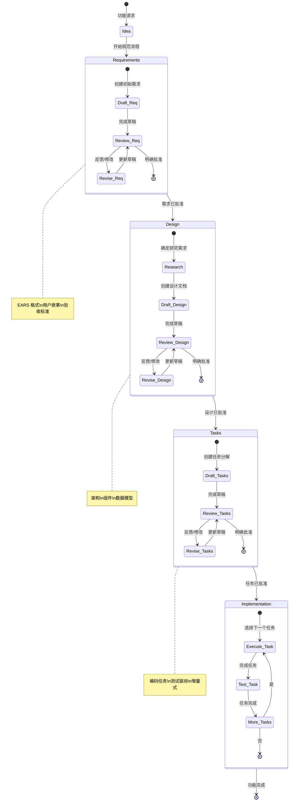
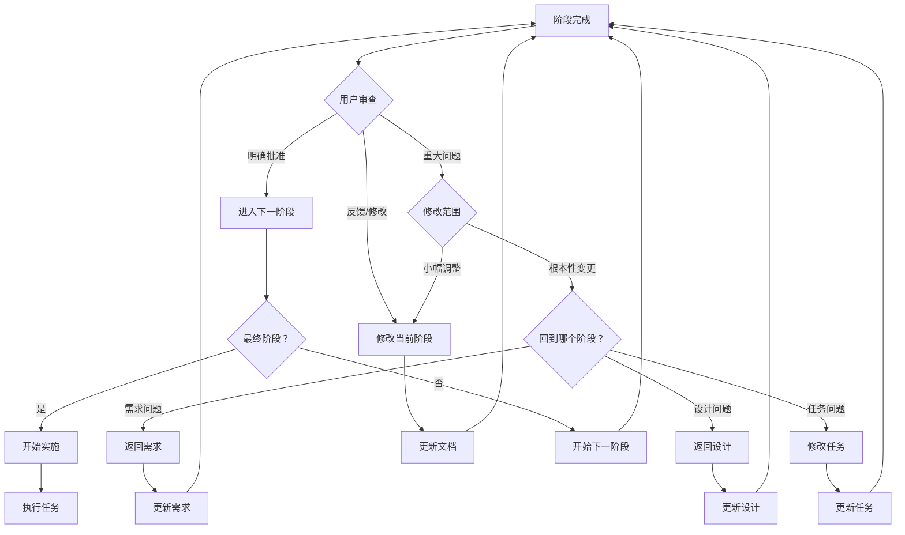
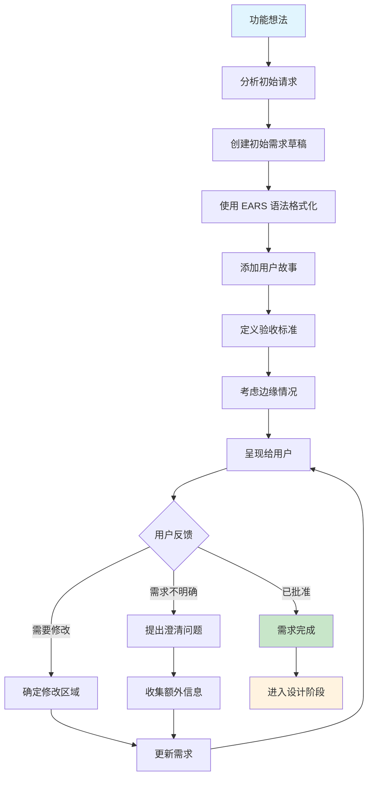
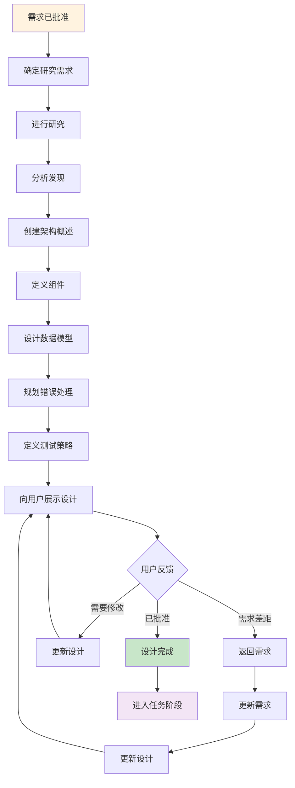
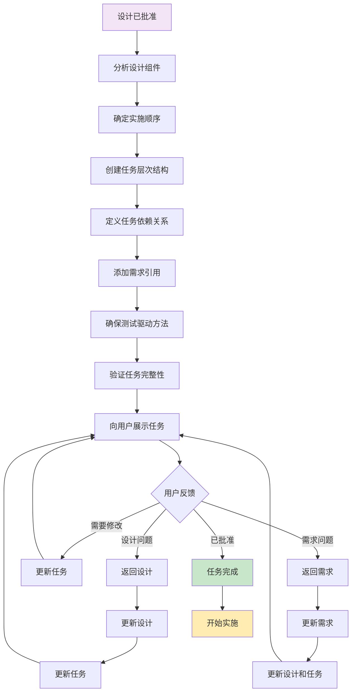
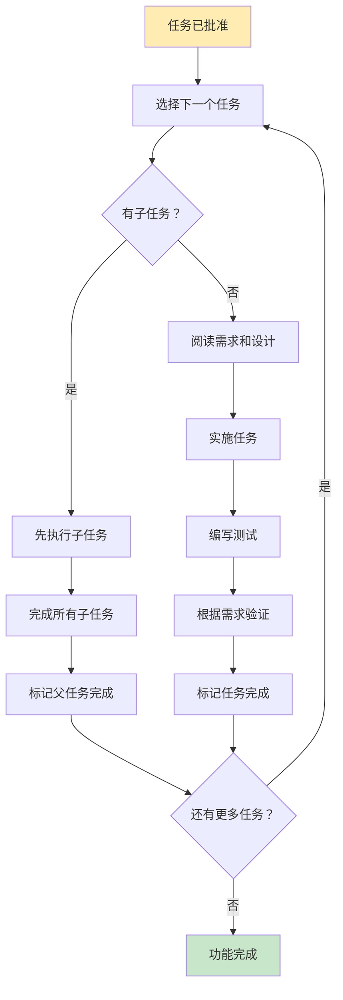
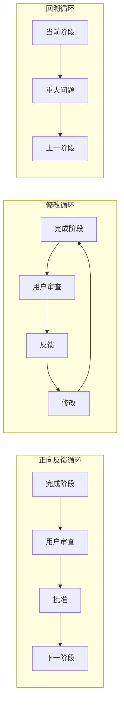

# 工作流程图和可视化辅助工具

本文档提供了规范驱动开发流程的可视化表示，包括完整的工作流程图、决策树和阶段转换流程。

## 完整流程图

以下图表展示了从初始想法到实施的完整规范驱动开发工作流程：

## 阶段转换决策树

此决策树帮助确定何时在阶段之间移动以及何时进行迭代：

## 需求阶段流程

需求收集阶段的详细工作流程：

## 设计阶段流程

设计阶段的详细工作流程：

## 任务阶段流程

将设计分解为实施任务的详细工作流程：

## 实施执行流程

从实施计划执行单个任务的工作流程：

## 反馈循环模式

处理反馈和迭代的常见模式：

