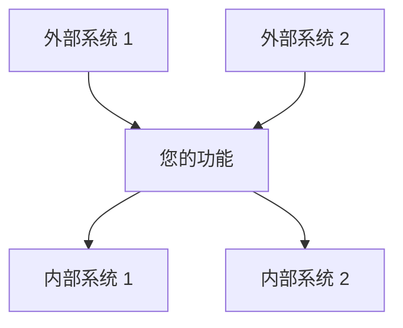
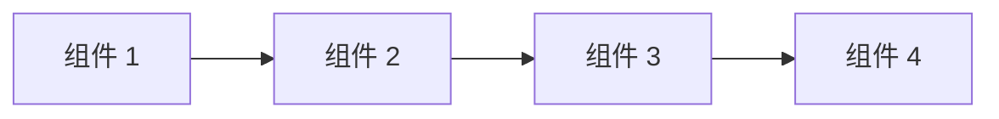
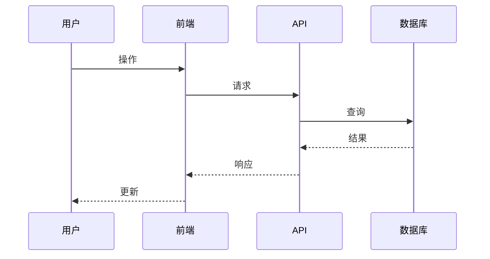

# 设计模板

<!-- 导航元数据 -->
<!-- 模板: 设计 | 级别: 模板 | 先决条件: requirements-template.md -->
<!-- 相关: process/design-phase.md, ai-reasoning/decision-frameworks.md, examples/complex-system-spec.md -->

**📍 您在这里:** [主指南](../../README.md) → [模板](README.md) → **设计模板**

## 快速导航
- **📚 学习流程:** [设计阶段指南](../process/design-phase.md) - 如何使用此模板
- **📖 查看示例:** [复杂系统设计](../examples/complex-system-spec.md#design-document) - 模板实际应用
- **🧠 决策帮助:** [决策框架](../ai-reasoning/decision-frameworks.md) - 如何做出设计选择
- **➡️ 下一个模板:** [任务模板](tasks-template.md) - 设计完成后

---

使用此模板创建全面的设计文档，将需求转化为技术规格。

## 文档信息

- **功能名称**: [您的功能名称]
- **版本**: 1.0
- **日期**: [当前日期]
- **作者**: [您的姓名]
- **审阅者**: [列出技术审阅者]
- **相关文档**: [链接到需求文档]

## 概述

[提供设计方法的高级摘要。解释此设计如何满足需求并融入整体系统架构。保持本节简洁但全面。]

### 设计目标
- [主要目标 1]
- [主要目标 2]
- [主要目标 3]

### 关键设计决策
- [决策 1 及理由]
- [决策 2 及理由]
- [决策 3 及理由]

## 架构

### 系统上下文
[描述此功能如何融入更广泛的系统。包括外部依赖和集成点。]



### 高级架构
[描述整体架构方法和主要组件。]



### 技术栈
|层面|技术|理由|
|---|---|---|
| 前端 | [技术] | [为什么选择] |
| 后端 | [技术] | [为什么选择] |
| 数据库 | [技术] | [为什么选择] |
| 基础设施 | [技术] | [为什么选择] |

## 组件和接口

### 组件 1: [组件名称]

**目的**: [此组件的功能]

**职责**:
- [职责 1]
- [职责 2]
- [职责 3]

**接口**:
- **输入**: [它接收什么]
- **输出**: [它产生什么]
- **依赖**: [它依赖什么]

**实现说明**:
- [关键实现细节 1]
- [关键实现细节 2]

### 组件 2: [组件名称]

**目的**: [此组件的功能]

**职责**:
- [职责 1]
- [职责 2]

**接口**:
- **输入**: [它接收什么]
- **输出**: [它产生什么]
- **依赖**: [它依赖什么]

**实现说明**:
- [关键实现细节 1]
- [关键实现细节 2]

### 组件 3: [组件名称]

**目的**: [此组件的功能]

**职责**:
- [职责 1]
- [职责 2]

**接口**:
- **输入**: [它接收什么]
- **输出**: [它产生什么]
- **依赖**: [它依赖什么]

**实现说明**:
- [关键实现细节 1]
- [关键实现细节 2]

## 数据模型

### 实体 1: [实体名称]

```typescript
interface EntityName {
  id: string;
  property1: string;
  property2: number;
  property3: boolean;
  createdAt: Date;
  updatedAt: Date;
}
```

**验证规则**:
- [验证规则 1]
- [验证规则 2]

**关系**:
- [与其他实体的关系]

### 实体 2: [实体名称]

```typescript
interface EntityName {
  id: string;
  property1: string;
  property2: EntityName[];
  status: 'active' | 'inactive' | 'pending';
}
```

**验证规则**:
- [验证规则 1]
- [验证规则 2]

**关系**:
- [与其他实体的关系]

### 数据流



## API 设计

### 端点 1: [端点名称]

**方法**: `POST`  
**路径**: `/api/v1/[resource]`

**请求**:
```json
{
  "property1": "string",
  "property2": "number",
  "property3": "boolean"
}
```

**响应**:
```json
{
  "id": "string",
  "property1": "string",
  "property2": "number",
  "createdAt": "ISO date string"
}
```

**错误响应**:
- `400 Bad Request`: [何时发生]
- `401 Unauthorized`: [何时发生]
- `404 Not Found`: [何时发生]

### 端点 2: [端点名称]

**方法**: `GET`  
**路径**: `/api/v1/[resource]/{id}`

**参数**:
- `id` (路径): [描述]
- `include` (查询, 可选): [描述]

**响应**:
```json
{
  "id": "string",
  "property1": "string",
  "property2": "number"
}
```

## 安全考虑

### 认证
- [认证方法和实现]
- [令牌管理方法]

### 授权
- [授权模型和规则]
- [权限检查策略]

### 数据保护
- [数据加密方法]
- [PII 处理程序]
- [数据保留策略]

### 输入验证
- [验证策略]
- [清理程序]
- [速率限制方法]

## 错误处理

### 错误类别
|类别|HTTP 状态|描述|用户操作|
|---|---|---|---|
| 验证 | 400 | 无效输入数据 | 修复输入并重试 |
| 认证 | 401 | 无效凭据 | 重新认证 |
| 授权 | 403 | 权限不足 | 联系管理员 |
| 未找到 | 404 | 资源不存在 | 检查资源标识符 |
| 服务器错误 | 500 | 内部系统错误 | 稍后重试或联系支持 |

### 错误响应格式
```json
{
  "error": {
    "code": "ERROR_CODE",
    "message": "人类可读的错误消息",
    "details": {
      "field": "特定字段错误"
    },
    "timestamp": "ISO 日期字符串",
    "requestId": "唯一的请求 ID"
  }
}
```

### 日志策略
- **错误日志**: [错误时记录什么]
- **审计日志**: [审计时记录什么]
- **性能日志**: [监控时记录什么]

## 性能考虑

### 预期负载
- **并发用户**: [数量]
- **每秒请求数**: [数量]
- **数据量**: [大小/增长率]

### 性能要求
- **响应时间**: [目标响应时间]
- **吞吐量**: [目标吞吐量]
- **可用性**: [正常运行时间要求]

### 优化策略
- [缓存策略]
- [数据库优化方法]
- [CDN 使用]
- [负载均衡方法]

### 监控和指标
- [关键性能指标]
- [监控工具和仪表板]
- [警报阈值]

## 测试策略

### 单元测试
- **覆盖率目标**: [百分比]
- **测试框架**: [框架名称]
- **关键测试领域**: [要测试的关键功能]

### 集成测试
- **API 测试**: [方法和工具]
- **数据库测试**: [方法和工具]
- **外部服务测试**: [模拟策略]

### 端到端测试
- **用户场景**: [要测试的关键用户旅程]
- **测试工具**: [E2E 测试框架]
- **测试环境**: [环境设置]

### 性能测试
- **负载测试**: [方法和工具]
- **压力测试**: [要测试的限制]
- **监控**: [要跟踪的性能指标]

## 部署和运维

### 部署策略
- [部署方法 (蓝绿、滚动等)]
- [环境进展]
- [回滚程序]

### 配置管理
- [配置方法]
- [特定于环境的设置]
- [密钥管理]

### 监控和警报
- [健康检查]
- [要监控的关键指标]
- [警报条件和升级]

### 维护程序
- [定期维护任务]
- [备份和恢复程序]
- [更新和补丁策略]

## 迁移和兼容性

### 数据迁移
- [迁移策略 (如果适用)]
- [数据转换要求]
- [回滚程序]

### 向后兼容性
- [API 版本控制策略]
- [重大变更程序]
- [弃用时间表]

### 集成影响
- [对现有系统的影响]
- [对依赖系统所需的更改]
- [变更沟通计划]

---

## 设计审查清单

使用此清单验证您的设计文档:

### 架构
- [ ] 高级架构描述清晰
- [ ] 组件职责定义明确
- [ ] 组件之间的接口已指定
- [ ] 技术选择有理由

### 需求对齐
- [ ] 设计满足所有功能需求
- [ ] 考虑了非功能性需求
- [ ] 此设计可以满足成功标准
- [ ] 解决了约束和假设

### 技术质量
- [ ] 设计遵循既定模式和原则
- [ ] 解决了安全考虑
- [ ] 考虑了性能要求
- [ ] 错误处理全面

### 实现准备
- [ ] 设计为实现提供了足够的细节
- [ ] 数据模型完整并经过验证
- [ ] API 规范详细
- [ ] 测试策略全面

### 可维护性
- [ ] 设计支持未来扩展性
- [ ] 组件松散耦合
- [ ] 配置已外部化
- [ ] 包括监控和可观察性

---

## 设计模式参考

### 常见模式考虑

**创建型模式**:
- 工厂: 当您需要创建对象而不指定确切类时
- 生成器: 当逐步构建复杂对象时
- 单例: 当您需要一个类的确切一个实例时

**结构型模式**:
- 适配器: 当集成不兼容的接口时
- 装饰器: 当添加行为而不改变结构时
- 外观: 当简化复杂子系统接口时

**行为型模式**:
- 观察者: 当对象需要被通知状态变化时
- 策略: 当您需要在算法之间切换时
- 命令: 当您需要用操作参数化对象时

**架构模式**:
- MVC/MVP/MVVM: 用于将表示与业务逻辑分离
- 仓库: 用于抽象数据访问逻辑
- 工作单元: 用于在多个操作中保持一致性

---

[← 需求模板](requirements-template.md) | [任务模板 →](tasks-template.md)